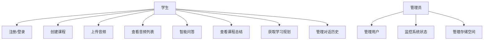
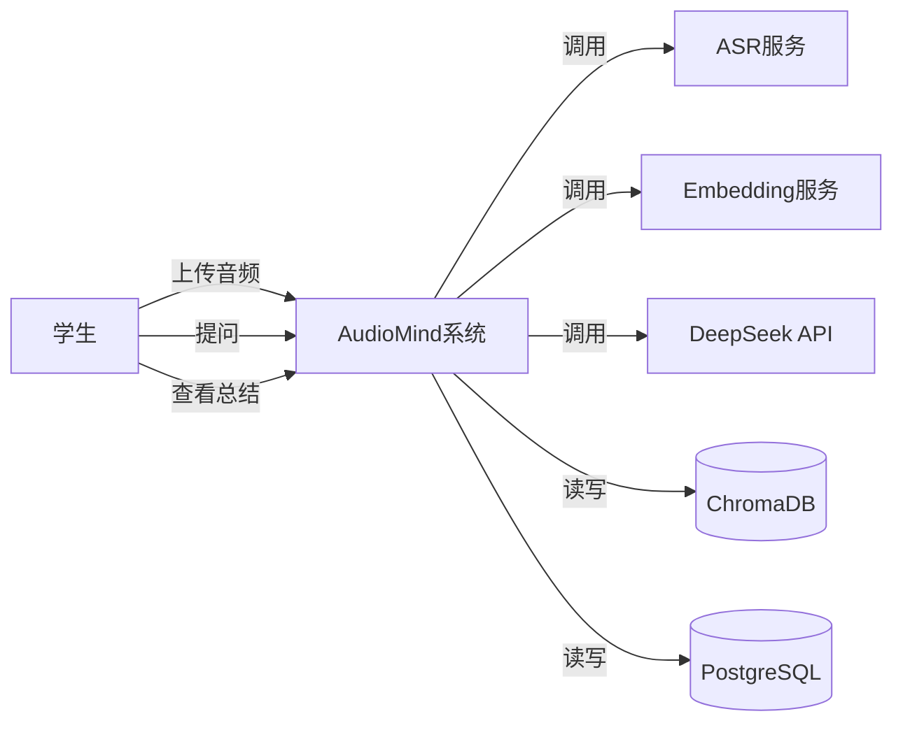
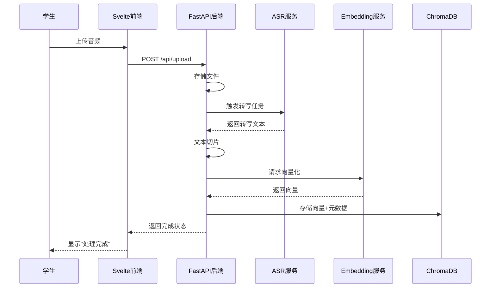

# AudioMind——软件需求规格说明书 (SRS)

> 版本：v1.0 | 日期：2026-06-09 | 状态：初稿

---

## 1. 引言

### 1.1 项目背景

大学生在课堂学习中面临一个普遍痛点：课堂录音时间长（通常90-120分钟），学生课后复习时需要反复回听、手动定位关键内容，效率极低。传统做法是手动记笔记或用通用播放器反复拖拽进度条，耗时且容易遗漏重点。

AudioMind 旨在通过"语音转文字 + 向量检索 + 大模型生成"三大技术组合，让学生可以通过自然语言直接"问"课堂录音——例如："老师上节课的作业要求是什么？""第三章的重点是什么？"，系统自动检索相关片段并生成精准回答。

### 1.2 项目目标

构建一个可运行的 Web 系统，实现：

1. 上传课堂录音 → 自动语音转文字
2. 文本切片 → 向量化 → 存入 ChromaDB 知识库
3. 自然语言问答 → RAG 检索 → DeepSeek 生成回答
4. 自动课程总结、学习规划生成
5. Docker 一键部署

### 1.3 术语定义

| 术语 | 说明 |
|------|------|
| RAG | Retrieval-Augmented Generation，检索增强生成 |
| ASR | Automatic Speech Recognition，自动语音识别 |
| Chunk | 文本切片，将长文本切分为适合检索的小段 |
| Embedding | 文本向量化，将文本转换为向量表示 |
| Agent | 基于 LLM 的智能代理，可调用工具完成复杂任务 |

### 1.4 参考资料

- DeepSeek API 文档
- ChromaDB 官方文档
- BGE Embedding 模型文档
- Whisper / FunASR 文档

---

## 2. 用户角色

| 角色 | 说明 |
|------|------|
| **学生** | 核心用户。上传录音、提问、查看总结、获取学习规划 |
| **管理员** | 系统运维。管理用户、监控系统状态、管理存储空间 |

---

## 3. 功能需求

### 3.1 功能列表总览

| 编号 | 功能模块 | 功能 | 优先级 | 描述 |
|------|----------|------|--------|------|
| F1 | 用户模块 | 用户注册/登录 | P0 | 邮箱注册，JWT 认证 |
| F2 | 用户模块 | 个人信息管理 | P2 | 修改密码、头像等 |
| F3 | 音频管理 | 音频上传 | P0 | 支持 mp3/wav/m4a，最大500MB |
| F4 | 音频管理 | 音频列表 | P0 | 查看已上传音频及处理状态 |
| F5 | 音频管理 | 音频删除 | P1 | 删除音频及关联数据 |
| F6 | 课程管理 | 创建课程 | P0 | 课程名称、学期、教师信息 |
| F7 | 课程管理 | 课程列表 | P0 | 按学期/时间筛选 |
| F8 | 课程管理 | 将音频关联到课程 | P0 | 一个课程可关联多个音频 |
| F9 | ASR 转写 | 自动语音转文字 | P0 | 上传后自动触发，支持中文为主 |
| F10 | ASR 转写 | 转写状态查询 | P0 | 轮询/WebSocket 获取进度 |
| F11 | 知识库 | 自动构建知识库 | P0 | 转写完成后自动切片+向量化 |
| F12 | 知识库 | 课程知识库管理 | P1 | 查看/重建/删除课程知识库 |
| F13 | 智能问答 | 单课程问答 | P0 | 基于RAG的课程内容问答 |
| F14 | 智能问答 | 跨课程问答 | P1 | 跨多个课程检索 |
| F15 | 智能问答 | 对话历史 | P0 | 保存对话记录，支持上下文 |
| F16 | 课程总结 | 自动生成课程总结 | P0 | 提取知识点、重点、作业要求 |
| F17 | 课程总结 | 总结导出 | P2 | 导出为 PDF/Markdown |
| F18 | 学习规划 | 生成学习计划 | P1 | 基于课程内容生成复习计划 |
| F19 | 学习规划 | 考点预测 | P2 | 基于内容分析可能的考点 |
| F20 | 系统管理 | 系统监控 | P2 | 存储、API 调用量统计 |

### 3.2 用例分析

#### 3.2.1 用例图（Mermaid）

#### 3.2.2 核心用例描述

**UC-01: 上传音频并获取转写**

| 字段 | 内容 |
|------|------|
| 用例编号 | UC-01 |
| 用例名称 | 上传音频并获取转写 |
| 参与者 | 学生 |
| 前置条件 | 用户已登录，已创建课程 |
| 基本流程 | 1. 用户选择课程 2. 上传音频文件 3. 系统接收并存储 4. 系统自动触发ASR转写 5. 转写完成，触发知识库构建 6. 用户收到完成通知 |
| 后置条件 | 音频转写文本已存储，知识库已构建 |
| 异常流程 | 音频格式不支持→提示格式错误; ASR转写失败→标记失败状态并提示 |

**UC-02: 智能问答**

| 字段 | 内容 |
|------|------|
| 用例编号 | UC-02 |
| 用例名称 | 智能问答 |
| 参与者 | 学生 |
| 前置条件 | 用户已登录，课程知识库已构建 |
| 基本流程 | 1. 用户选择课程 2. 输入自然语言问题 3. 系统将问题向量化 4. 在ChromaDB中检索Top-K相关片段 5. 拼接上下文发送给DeepSeek 6. DeepSeek生成回答 7. 返回答案及引用来源 |
| 后置条件 | 对话记录已保存 |
| 异常流程 | 检索无结果→提示"课程中未找到相关内容"; API超时→返回错误提示 |

**UC-03: 获取课程总结**

| 字段 | 内容 |
|------|------|
| 用例编号 | UC-03 |
| 用例名称 | 获取课程总结 |
| 参与者 | 学生 |
| 前置条件 | 用户已登录，课程知识库已构建 |
| 基本流程 | 1. 用户选择课程 2. 点击"生成总结" 3. 系统检索课程全部Chunk 4. 发送给DeepSeek生成结构化总结 5. 显示总结（知识点、重点、作业要求） |
| 后置条件 | 总结已生成并缓存 |
| 异常流程 | 课程内容过多→分段总结后合并 |

---

## 4. 非功能需求

### 4.1 性能要求

| 指标 | 要求 |
|------|------|
| 并发用户数 | 支持 50 用户同时在线 |
| 音频上传 | 单文件最大 500MB，支持断点续传 |
| ASR 转写速度 | 1小时音频 < 10分钟转写完成（GPU环境） |
| 检索响应时间 | Top-K 检索 < 500ms |
| 问答响应时间 | 端到端 < 10s（含 LLM 生成时间） |

### 4.2 响应时间要求

| 操作 | 目标响应时间 |
|------|-------------|
| 页面加载 | < 2s |
| 音频上传（100MB） | < 30s |
| ASR 转写（1h音频） | < 10min |
| 知识库检索 | < 500ms |
| RAG 问答 | < 10s |
| 课程总结生成 | < 30s |

### 4.3 可扩展性要求

- 前后端分离架构，各服务独立部署
- 支持水平扩展：ASR 服务、Embedding 服务可独立扩容
- ChromaDB 支持持久化存储，可迁移至分布式部署
- API 设计遵循 RESTful 规范，便于未来对接移动端

### 4.4 安全性要求

| 项目 | 要求 |
|------|------|
| 认证 | JWT Token，过期时间 24h |
| 密码存储 | bcrypt 加密 |
| 文件上传 | 限制类型（mp3/wav/m4a），限制大小 |
| API 安全 | CORS 白名单，Rate Limiting |
| 数据隔离 | 用户只能访问自己的数据 |
| 敏感信息 | API Key 等通过环境变量注入 |

### 4.5 可维护性要求

- 代码遵循 PEP 8 (Python) / ESLint (Svelte) 规范
- 关键模块单元测试覆盖率 > 70%
- Docker Compose 一键部署
- 日志统一使用结构化日志（JSON 格式）
- 提供健康检查接口 `/api/health`

---

## 5. 数据流图

### 5.1 顶层数据流

### 5.2 音频处理数据流

