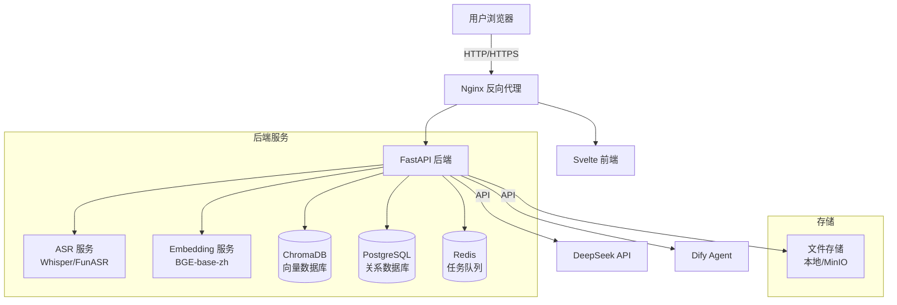
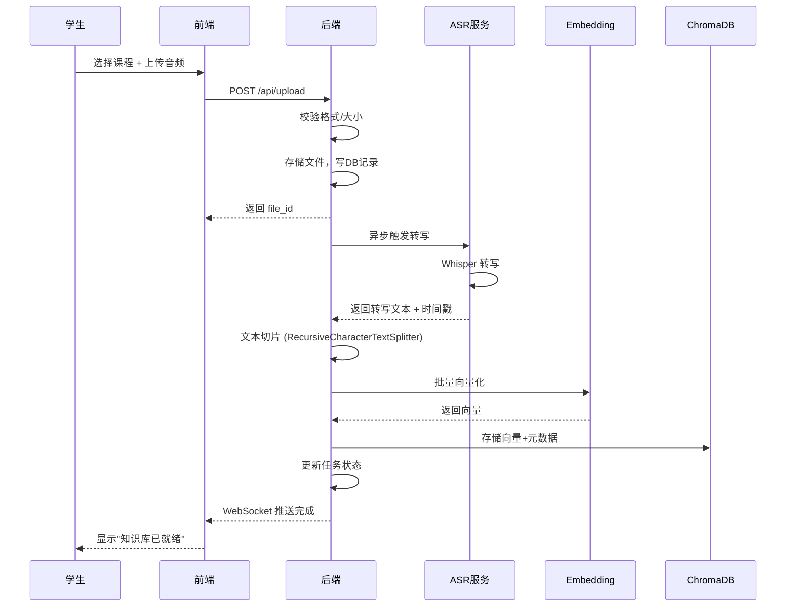
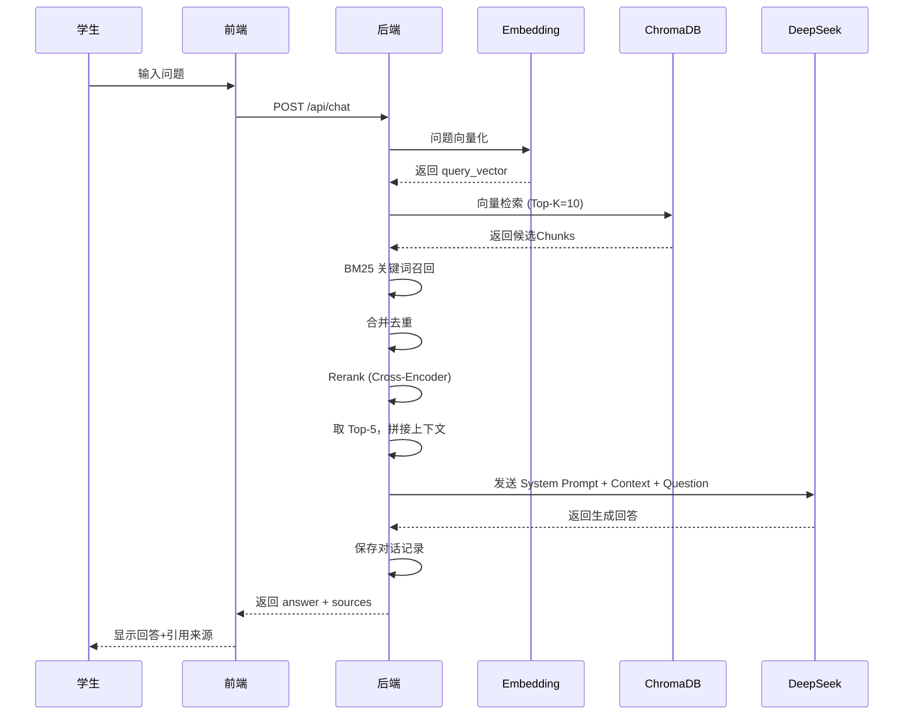

# AudioMind——系统设计说明书 (SDD)

> 版本：v1.0 | 日期：2026-06-09 | 状态：初稿

---

## 1. 系统总体架构

### 1.1 架构图



### 1.2 架构分层

| 层 | 技术 | 职责 |
|-----|------|------|
| 表现层 | Svelte + TailwindCSS | 用户界面，交互逻辑 |
| 网关层 | Nginx | 反向代理，静态资源，HTTPS |
| 应用层 | FastAPI | 业务逻辑，API接口 |
| 服务层 | Whisper/BGE/ChromaDB | 语音识别、向量化、向量检索 |
| 数据层 | PostgreSQL + Redis | 关系数据、缓存、任务队列 |
| 外部服务 | DeepSeek API + Dify | 大模型生成、Agent编排 |

### 1.3 技术选型理由

| 技术 | 理由 |
|------|------|
| **Svelte** | 编译时框架，运行时轻量，学习曲线低，适合中小型团队 |
| **FastAPI** | 异步支持，自动生成 OpenAPI 文档，性能优秀 |
| **Whisper** | OpenAI 开源，多语言支持好，中文识别准确率高 |
| **ChromaDB** | 轻量级向量数据库，Python 原生支持，部署简单 |
| **BGE-base-zh** | 中文 Embedding 评测表现优秀，模型大小适中（~400MB） |
| **DeepSeek** | 中文理解和生成能力强，API 价格合理 |
| **Dify** | 可视化 Agent 编排，降低 Agent 开发复杂度 |
| **Docker Compose** | 一键部署，服务编排简单 |

---

## 2. 模块划分

### 2.1 模块总览

```
AudioMind/
├── frontend/          # Svelte 前端
├── backend/           # FastAPI 后端
│   ├── api/           # API 路由
│   ├── core/          # 配置、安全
│   ├── models/        # ORM 模型
│   ├── services/      # 业务逻辑
│   ├── schemas/       # Pydantic 模式
│   └── tasks/         # 异步任务
├── asr_service/       # ASR 服务
├── embedding_service/ # Embedding 服务
├── docker/            # Docker 配置
└── docs/              # 文档
```

### 2.2 模块详细设计

#### 2.2.1 用户模块 (User Module)

| 项目 | 说明 |
|------|------|
| 职责 | 用户注册、登录、认证、信息管理 |
| 技术 | FastAPI + JWT + bcrypt + PostgreSQL |
| 输入 | 注册表单、登录凭证 |
| 输出 | JWT Token、用户信息 |
| 接口 | POST /api/auth/register, POST /api/auth/login, GET /api/user/me |

#### 2.2.2 文件管理模块 (File Module)

| 项目 | 说明 |
|------|------|
| 职责 | 音频文件上传、存储、元数据管理 |
| 技术 | FastAPI UploadFile + 本地存储/MinIO |
| 输入 | 音频文件 (mp3/wav/m4a) |
| 输出 | 文件ID、上传状态 |
| 接口 | POST /api/upload, GET /api/files, DELETE /api/files/{id} |

#### 2.2.3 ASR 模块 (ASR Module)

| 项目 | 说明 |
|------|------|
| 职责 | 语音转文字，支持中英文混合识别 |
| 技术 | Whisper (large-v3) 或 FunASR (Paraformer) |
| 输入 | 音频文件路径 |
| 输出 | 带时间戳的转写文本 |
| 接口 | POST /api/asr/transcribe, GET /api/asr/status/{task_id} |

#### 2.2.4 知识库模块 (Knowledge Module)

| 项目 | 说明 |
|------|------|
| 职责 | 文本切片、向量化、存储、检索 |
| 技术 | LangChain TextSplitter + BGE-base-zh + ChromaDB |
| 输入 | 转写文本 |
| 输出 | 向量索引、检索结果 |
| 接口 | POST /api/knowledge/build, DELETE /api/knowledge/{course_id}, GET /api/knowledge/search |

#### 2.2.5 RAG 检索模块 (RAG Module)

| 项目 | 说明 |
|------|------|
| 职责 | 查询向量化、多路召回、Rerank、上下文拼接 |
| 技术 | BGE Embedding + ChromaDB + BM25 + Cross-Encoder Rerank |
| 输入 | 用户自然语言问题 |
| 输出 | Top-K 相关文段 + Rerank 排序结果 |
| 接口 | POST /api/rag/retrieve |

#### 2.2.6 Agent 模块 (Agent Module)

| 项目 | 说明 |
|------|------|
| 职责 | 基于检索结果生成回答、课程总结、学习规划 |
| 技术 | DeepSeek API + Dify Agent + Prompt Engineering |
| 输入 | 用户问题 + 检索上下文 |
| 输出 | 回答/总结/规划文本 |
| 接口 | POST /api/chat, GET /api/summary/{course_id}, GET /api/plan/{course_id} |

#### 2.2.7 学习规划模块 (Plan Module)

| 项目 | 说明 |
|------|------|
| 职责 | 分析课程内容，生成结构化学习/复习计划 |
| 技术 | Agent 调用 DeepSeek，分析知识点分布 |
| 输入 | 课程ID |
| 输出 | 分阶段学习计划（含时间安排、重点标注） |
| 接口 | GET /api/plan/{course_id} |

---

## 3. 核心流程设计

### 3.1 音频上传 → 知识库构建 流程



### 3.2 RAG 问答流程


