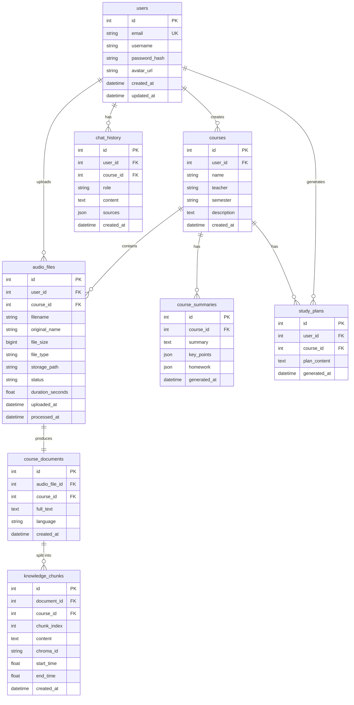

# AudioMind——数据库设计文档

> 版本：v1.0 | 日期：2026-06-09 | 状态：初稿

---

## 1. ER 图



---

## 2. 表结构（关系型数据库: PostgreSQL）

### 2.1 表汇总

| 表名 | 说明 | 存储引擎 |
|------|------|----------|
| users | 用户表 | PostgreSQL |
| courses | 课程表 | PostgreSQL |
| audio_files | 音频文件表 | PostgreSQL |
| course_documents | 转写文档表 | PostgreSQL |
| knowledge_chunks | 知识块索引表 | PostgreSQL |
| chat_history | 对话历史表 | PostgreSQL |
| course_summaries | 课程总结表 | PostgreSQL |
| study_plans | 学习计划表 | PostgreSQL |

### 2.2 ChromaDB 集合设计

| 集合名 | 说明 | 元数据字段 |
|--------|------|-----------|
| course_chunks | 课程知识块向量 | course_id, chunk_index, start_time, end_time, document_id |

---

## 3. 建表 SQL

```sql
-- ============================================
-- AudioMind 数据库建表语句
-- 数据库: PostgreSQL 15+
-- ============================================

-- 3.1 用户表
CREATE TABLE users (
    id SERIAL PRIMARY KEY,
    email VARCHAR(255) UNIQUE NOT NULL,
    username VARCHAR(100) NOT NULL,
    password_hash VARCHAR(255) NOT NULL,
    avatar_url VARCHAR(500),
    created_at TIMESTAMP DEFAULT CURRENT_TIMESTAMP,
    updated_at TIMESTAMP DEFAULT CURRENT_TIMESTAMP
);

CREATE INDEX idx_users_email ON users(email);

-- ============================================

-- 3.2 课程表
CREATE TABLE courses (
    id SERIAL PRIMARY KEY,
    user_id INTEGER NOT NULL REFERENCES users(id) ON DELETE CASCADE,
    name VARCHAR(255) NOT NULL,
    teacher VARCHAR(100),
    semester VARCHAR(50),
    description TEXT,
    created_at TIMESTAMP DEFAULT CURRENT_TIMESTAMP
);

CREATE INDEX idx_courses_user_id ON courses(user_id);
CREATE INDEX idx_courses_semester ON courses(semester);

-- ============================================

-- 3.3 音频文件表
CREATE TABLE audio_files (
    id SERIAL PRIMARY KEY,
    user_id INTEGER NOT NULL REFERENCES users(id) ON DELETE CASCADE,
    course_id INTEGER NOT NULL REFERENCES courses(id) ON DELETE CASCADE,
    filename VARCHAR(500) NOT NULL,
    original_name VARCHAR(500) NOT NULL,
    file_size BIGINT NOT NULL,
    file_type VARCHAR(20) NOT NULL CHECK (file_type IN ('mp3', 'wav', 'm4a', 'flac')),
    storage_path VARCHAR(1000) NOT NULL,
    status VARCHAR(20) DEFAULT 'uploaded'
        CHECK (status IN ('uploaded', 'transcribing', 'transcribed', 'indexing', 'completed', 'failed')),
    duration_seconds REAL,
    uploaded_at TIMESTAMP DEFAULT CURRENT_TIMESTAMP,
    processed_at TIMESTAMP
);

CREATE INDEX idx_audio_files_user_id ON audio_files(user_id);
CREATE INDEX idx_audio_files_course_id ON audio_files(course_id);
CREATE INDEX idx_audio_files_status ON audio_files(status);

-- ============================================

-- 3.4 课程文档表（转写结果）
CREATE TABLE course_documents (
    id SERIAL PRIMARY KEY,
    audio_file_id INTEGER UNIQUE NOT NULL REFERENCES audio_files(id) ON DELETE CASCADE,
    course_id INTEGER NOT NULL REFERENCES courses(id) ON DELETE CASCADE,
    full_text TEXT NOT NULL,
    language VARCHAR(10) DEFAULT 'zh',
    created_at TIMESTAMP DEFAULT CURRENT_TIMESTAMP
);

CREATE INDEX idx_course_documents_course_id ON course_documents(course_id);

-- ============================================

-- 3.5 知识块索引表（关联 ChromaDB）
CREATE TABLE knowledge_chunks (
    id SERIAL PRIMARY KEY,
    document_id INTEGER NOT NULL REFERENCES course_documents(id) ON DELETE CASCADE,
    course_id INTEGER NOT NULL REFERENCES courses(id) ON DELETE CASCADE,
    chunk_index INTEGER NOT NULL,
    content TEXT NOT NULL,
    chroma_id VARCHAR(255) UNIQUE NOT NULL,
    start_time REAL,
    end_time REAL,
    created_at TIMESTAMP DEFAULT CURRENT_TIMESTAMP
);

CREATE INDEX idx_knowledge_chunks_document_id ON knowledge_chunks(document_id);
CREATE INDEX idx_knowledge_chunks_course_id ON knowledge_chunks(course_id);
CREATE INDEX idx_knowledge_chunks_chroma_id ON knowledge_chunks(chroma_id);

-- ============================================

-- 3.6 对话历史表
CREATE TABLE chat_history (
    id SERIAL PRIMARY KEY,
    user_id INTEGER NOT NULL REFERENCES users(id) ON DELETE CASCADE,
    course_id INTEGER REFERENCES courses(id) ON DELETE SET NULL,
    role VARCHAR(20) NOT NULL CHECK (role IN ('user', 'assistant', 'system')),
    content TEXT NOT NULL,
    sources JSONB,
    created_at TIMESTAMP DEFAULT CURRENT_TIMESTAMP
);

CREATE INDEX idx_chat_history_user_id ON chat_history(user_id);
CREATE INDEX idx_chat_history_course_id ON chat_history(course_id);
CREATE INDEX idx_chat_history_created_at ON chat_history(created_at);

-- ============================================

-- 3.7 课程总结表
CREATE TABLE course_summaries (
    id SERIAL PRIMARY KEY,
    course_id INTEGER UNIQUE NOT NULL REFERENCES courses(id) ON DELETE CASCADE,
    summary TEXT NOT NULL,
    key_points JSONB,
    homework JSONB,
    generated_at TIMESTAMP DEFAULT CURRENT_TIMESTAMP
);

-- ============================================

-- 3.8 学习计划表
CREATE TABLE study_plans (
    id SERIAL PRIMARY KEY,
    user_id INTEGER NOT NULL REFERENCES users(id) ON DELETE CASCADE,
    course_id INTEGER NOT NULL REFERENCES courses(id) ON DELETE CASCADE,
    plan_content TEXT NOT NULL,
    generated_at TIMESTAMP DEFAULT CURRENT_TIMESTAMP
);

CREATE INDEX idx_study_plans_user_course ON study_plans(user_id, course_id);
```

---

## 4. ChromaDB 集合操作（Python 示例）

```python
import chromadb
from chromadb.config import Settings

# 初始化客户端
client = chromadb.PersistentClient(
    path="./chroma_data",
    settings=Settings(anonymized_telemetry=False)
)

# 创建/获取集合
collection = client.get_or_create_collection(
    name="course_chunks",
    metadata={"hnsw:space": "cosine"}  # 余弦相似度
)

# 添加向量
collection.add(
    ids=[f"chunk_{chunk.id}"],
    embeddings=[embedding_vector],
    metadatas=[{
        "course_id": chunk.course_id,
        "document_id": chunk.document_id,
        "chunk_index": chunk.chunk_index,
        "start_time": chunk.start_time,
        "end_time": chunk.end_time,
        "content_preview": chunk.content[:200]
    }],
    documents=[chunk.content]
)

# 检索
results = collection.query(
    query_embeddings=[query_vector],
    n_results=10,
    where={"course_id": course_id}
)
```

---

## 5. 索引策略

| 表 | 索引 | 类型 | 用途 |
|----|------|------|------|
| users | email | UNIQUE B-Tree | 登录查询 |
| courses | user_id | B-Tree | 用户课程列表 |
| courses | semester | B-Tree | 按学期筛选 |
| audio_files | user_id | B-Tree | 用户文件列表 |
| audio_files | course_id | B-Tree | 课程文件关联 |
| audio_files | status | B-Tree | 状态筛选 |
| knowledge_chunks | course_id | B-Tree | 课程知识块查询 |
| knowledge_chunks | chroma_id | UNIQUE B-Tree | ChromaDB 关联 |
| chat_history | user_id, course_id | B-Tree | 对话历史查询 |
| study_plans | user_id, course_id | B-Tree | 学习计划查询 |

---

## 6. 数据生命周期管理


