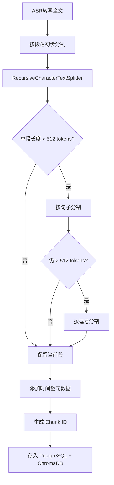

# AudioMind——RAG 方案设计文档

> 版本：v1.0 | 日期：2026-06-09 | 状态：初稿

---

## 1. 整体方案概述

AudioMind 采用 **混合检索 + Rerank** 的 RAG 方案：

```
用户问题 → Query改写 → 向量检索(Top-K=20) + BM25关键词检索(Top-K=20)
         → 合并去重 → Cross-Encoder Rerank → Top-5 Chunks
         → Prompt拼接 → DeepSeek生成 → 返回回答+引用
```

---

## 2. 文本切片策略

### 2.1 切片方案

| 参数 | 值 | 理由 |
|------|-----|------|
| 切片器 | RecursiveCharacterTextSplitter | 递归按分隔符切割，保持语义完整性 |
| Chunk大小 | 512 tokens | 约300-400个中文字符，适合单段完整语义 |
| 重叠大小 | 128 tokens | 25%重叠率，保证上下文连续性 |
| 分隔符优先级 | `["\n\n", "\n", "。", "，", " ", ""]` | 优先按段落切，其次按句子 |

### 2.2 切片流程图



### 2.3 代码示例

```python
from langchain.text_splitter import RecursiveCharacterTextSplitter

text_splitter = RecursiveCharacterTextSplitter(
    chunk_size=512,
    chunk_overlap=128,
    separators=["\n\n", "\n", "。", "，", " ", ""],
    length_function=len,
    is_separator_regex=False,
)

chunks = text_splitter.create_documents(
    texts=[full_transcript],
    metadatas=[{"course_id": course_id, "start_time": t} for t in timestamps]
)
```

### 2.4 时间戳保留策略

由于 ASR 输出带时间戳，每个 Chunk 保留起止时间：

```python
chunk_metadata = {
    "course_id": 1,
    "chunk_index": 0,
    "start_time": 0.0,       # 秒
    "end_time": 45.2,
    "document_id": 1
}
```

前端可据此在回答中添加"跳转到音频对应位置"功能。

---

## 3. Embedding 方案

### 3.1 模型选择

| 模型 | 维度 | 大小 | 中文评测 MTEB | 选择理由 |
|------|------|------|-------------|----------|
| **BGE-base-zh-v1.5** | 768 | ~400MB | 领先 | 中文语义理解优秀，性价比高 |
| BGE-small-zh-v1.5 | 512 | ~95MB | 良好 | 轻量备选，适合资源受限环境 |
| BGE-large-zh-v1.5 | 1024 | ~1.3GB | SOTA | 最高精度，但资源消耗大 |

**推荐：BGE-base-zh-v1.5**，在精度和资源消耗之间取得最佳平衡。

### 3.2 部署方式

```python
# 独立 Embedding 微服务
from sentence_transformers import SentenceTransformer

model = SentenceTransformer("BAAI/bge-base-zh-v1.5")

# BGE 模型需要添加 instruction 前缀
query_instruction = "为这个句子生成表示以用于检索相关文章："
passage_instruction = ""  # 文档侧不需要前缀

def encode_query(text: str) -> list[float]:
    return model.encode(
        query_instruction + text,
        normalize_embeddings=True
    ).tolist()

def encode_passages(texts: list[str]) -> list[list[float]]:
    return model.encode(
        texts,
        normalize_embeddings=True,
        batch_size=32
    ).tolist()
```

### 3.3 性能预估

| 场景 | 耗时 |
|------|------|
| 单条 Query 向量化 | ~50ms (CPU) / ~10ms (GPU) |
| 批量 100 条向量化 | ~2s (CPU) / ~200ms (GPU) |
| 1小时课程 (~450 chunks) | ~10s (CPU) / ~1s (GPU) |

---

## 4. ChromaDB 存储结构

### 4.1 集合设计

```
Collection: course_chunks
├── 距离度量: cosine
├── HNSW 索引参数:
│   ├── M: 16
│   └── ef_construction: 200
├── 数据:
│   ├── ids: [chunk_uuid_1, chunk_uuid_2, ...]
│   ├── embeddings: [[0.12, -0.34, ...], ...]
│   ├── documents: [chunk_text_1, chunk_text_2, ...]
│   └── metadatas: [{course_id, chunk_index, start_time, end_time}, ...]
└── 持久化路径: ./chroma_data/
```

### 4.2 Collection 初始化

```python
import chromadb

client = chromadb.PersistentClient(path="./chroma_data")

collection = client.get_or_create_collection(
    name="course_chunks",
    metadata={"hnsw:space": "cosine"}
)
```

### 4.3 数据隔离方案

**方案：单 Collection + course_id 过滤**

```python
# 写入时标记 course_id
collection.add(
    ids=[chunk_id],
    embeddings=[embedding],
    metadatas=[{"course_id": 1, "chunk_index": 0, ...}],
    documents=[chunk_text]
)

# 检索时过滤
results = collection.query(
    query_embeddings=[query_vector],
    n_results=20,
    where={"course_id": 1}  # 仅检索指定课程
)
```

**方案选择理由：**
- 单 Collection 管理简单，无需为每个课程创建独立 Collection
- ChromaDB 的 `where` 过滤基于元数据索引，性能足够
- 避免了 Collection 数量爆炸问题

---

## 5. 混合检索方案

### 5.1 双路召回

```
         用户问题
            │
    ┌───────┴───────┐
    ▼               ▼
向量检索          关键词检索
(Top-20)          (BM25 Top-20)
    │               │
    └───────┬───────┘
            ▼
      合并去重 (RRF)
            │
            ▼
      Cross-Encoder
         Rerank
            │
            ▼
         Top-5
```

### 5.2 向量检索（语义匹配）

```python
def vector_search(query: str, course_id: int, top_k: int = 20):
    query_embedding = embedder.encode_query(query)
    results = collection.query(
        query_embeddings=[query_embedding],
        n_results=top_k,
        where={"course_id": course_id},
        include=["documents", "metadatas", "distances"]
    )
    return results
```

### 5.3 BM25 关键词检索（精确匹配）

```python
from rank_bm25 import BM25Okapi
import jieba

class BM25Retriever:
    def __init__(self, chunks: list[str]):
        tokenized = [list(jieba.cut(chunk)) for chunk in chunks]
        self.bm25 = BM25Okapi(tokenized)

    def search(self, query: str, top_k: int = 20):
        tokenized_query = list(jieba.cut(query))
        scores = self.bm25.get_scores(tokenized_query)
        top_indices = sorted(range(len(scores)),
                            key=lambda i: scores[i], reverse=True)[:top_k]
        return top_indices, [scores[i] for i in top_indices]
```

### 5.4 RRF 融合（Reciprocal Rank Fusion）

```python
def rrf_fusion(vector_results, bm25_results, k=60):
    scores = {}
    for rank, chunk_id in enumerate(vector_results):
        scores[chunk_id] = scores.get(chunk_id, 0) + 1 / (k + rank + 1)
    for rank, chunk_id in enumerate(bm25_results):
        scores[chunk_id] = scores.get(chunk_id, 0) + 1 / (k + rank + 1)
    return sorted(scores.items(), key=lambda x: x[1], reverse=True)
```

---

## 6. Rerank 方案

### 6.1 模型选择

| 方案 | 精度 | 延迟 | 适用场景 |
|------|------|------|----------|
| BGE-Reranker-v2-m3 | 高 | ~50ms/对 | 推荐（中文友好） |
| bge-reranker-base | 中 | ~30ms/对 | 资源受限备选 |
| 基于 LLM 打分 | 最高 | ~500ms/对 | 高精度需求场景 |

**推荐：BGE-Reranker-v2-m3**，对中文 Cross-Encoding 效果好，每条 50ms 内完成。

### 6.2 实现

```python
from FlagEmbedding import FlagReranker

reranker = FlagReranker("BAAI/bge-reranker-v2-m3")

def rerank(query: str, candidates: list[dict], top_k: int = 5):
    pairs = [[query, c["content"]] for c in candidates]
    scores = reranker.compute_score(pairs)
    for i, score in enumerate(scores):
        candidates[i]["rerank_score"] = score
    candidates.sort(key=lambda x: x["rerank_score"], reverse=True)
    return candidates[:top_k]
```

---

## 7. 上下文拼接策略

### 7.1 Prompt 模板

```
你是一个课堂知识助手。请根据以下课程内容片段回答用户问题。

## 课程信息
课程名称：{course_name}
教师：{teacher}

## 相关内容片段
---
片段1 (时间: {start_time}-{end_time}):
{chunk_1_content}

---
片段2 (时间: {start_time}-{end_time}):
{chunk_2_content}

---
片段3 (时间: {start_time}-{end_time}):
{chunk_3_content}

---

## 用户问题
{question}

## 回答要求
1. 仅根据以上片段内容回答，不要编造
2. 如果片段不足以回答问题，明确说明"课程内容中未找到相关信息"
3. 回答时标注引用来源（片段编号和时间）
4. 使用中文回答，条理清晰
```

### 7.2 Token 预算分配

```
总预算: 4096 tokens (DeepSeek 输入窗口)
├── System Prompt: ~200 tokens
├── 检索 Chunk 内容: 5 × ~500 tokens = ~2500 tokens
├── 对话历史: ~500 tokens
└── 用户问题 + 缓冲: ~900 tokens
```

---

## 8. 优缺点分析

### 8.1 优点

| 优点 | 说明 |
|------|------|
| **语义 + 关键词双召回** | 互补检索，兼顾语义理解和精确匹配 |
| **Rerank 精排** | 显著提升 Top-K 精度，减少无关内容干扰 |
| **时间戳保留** | 可回溯音频原始位置，增强可信度 |
| **资源友好** | BGE-base-zh + ChromaDB 可在单 GPU 服务器运行 |
| **数据隔离** | course_id 过滤，保证检索范围精准 |

### 8.2 缺点与缓解

| 缺点 | 缓解措施 |
|------|----------|
| ASR 转写错误影响检索 | 后处理纠错 + Query 扩展; 保留音频原始时间戳供人工核对 |
| 跨课程知识关联困难 | Phase 2 引入知识图谱; 当前通过用户手动切换课程 |
| BM25 内存占用 | 按课程懒加载 BM25 索引，使用后释放 |
| 中英混合场景 Embedding 效果下降 | 选择多语言版本的 BGE-M3 作为备选 |
| 长文本总结质量波动 | 采用 Map-Reduce 分段总结策略 |

---

## 9. 评估方案

| 指标 | 方法 | 目标值 |
|------|------|--------|
| 检索 Recall@10 | 标注测试集 | > 85% |
| 检索 MRR | 标注测试集 | > 0.7 |
| 回答准确率 | 人工评估 | > 80% |
| 端到端延迟 | 系统监控 | P95 < 10s |
