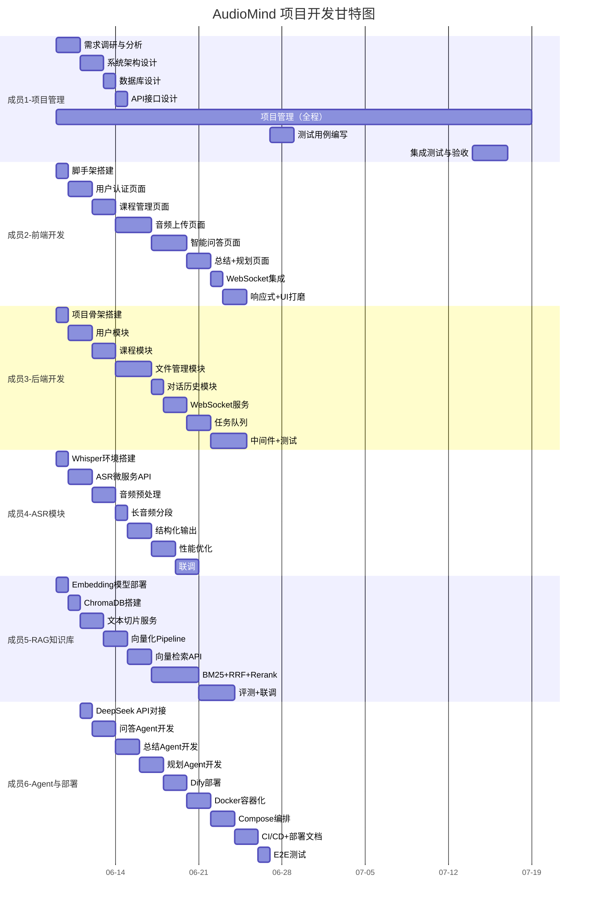

# AudioMind——项目开发计划书

> 版本：v1.0 | 日期：2026-06-09 | 状态：初稿 | 团队规模：6人

---

## 1. WBS 任务分解

### 1.1 一级分解

```
AudioMind 项目
├── 1. 项目管理与需求分析 (成员1)
├── 2. 前端开发 (成员2)
├── 3. 后端开发 (成员3)
├── 4. ASR 模块 (成员4)
├── 5. RAG 知识库 (成员5)
└── 6. Agent 与部署 (成员6)
```

### 1.2 详细 WBS

#### WBS-1: 项目管理与需求分析 (成员1)

| 编号 | 任务 | 工时(天) | 交付物 |
|------|------|----------|--------|
| 1.1 | 需求调研与分析 | 2 | 需求规格说明书 |
| 1.2 | 系统架构设计 | 2 | 系统设计说明书 |
| 1.3 | 数据库设计 | 1 | ER图+SQL |
| 1.4 | API 接口设计 | 1 | API文档 |
| 1.5 | 项目管理（全程） | 持续 | 周报、进度跟踪 |
| 1.6 | 测试用例编写 | 2 | 测试用例文档 |
| 1.7 | 集成测试与验收 | 3 | 测试报告 |
| **小计** | | **11** | |

#### WBS-2: 前端开发 (成员2)

| 编号 | 任务 | 工时(天) | 交付物 |
|------|------|----------|--------|
| 2.1 | 项目脚手架搭建 (Svelte + Tailwind) | 1 | 项目初始化 |
| 2.2 | 用户认证页面 (登录/注册) | 2 | 登录注册页 |
| 2.3 | 课程管理页面 (创建/列表/详情) | 2 | 课程CRUD |
| 2.4 | 音频上传页面 (上传/进度/列表) | 3 | 上传+管理 |
| 2.5 | 智能问答页面 (聊天界面+引用) | 3 | 对话交互 |
| 2.6 | 课程总结展示页面 | 1 | 总结展示 |
| 2.7 | 学习规划展示页面 | 1 | 规划展示 |
| 2.8 | WebSocket 实时通知集成 | 1 | 实时状态 |
| 2.9 | 响应式适配+UI打磨 | 2 | 完整前端 |
| **小计** | | **16** | |

#### WBS-3: 后端开发 (成员3)

| 编号 | 任务 | 工时(天) | 交付物 |
|------|------|----------|--------|
| 3.1 | FastAPI 项目骨架搭建 | 1 | 项目结构 |
| 3.2 | 用户模块 (注册/登录/JWT) | 2 | 认证API |
| 3.3 | 课程模块 (CRUD API) | 2 | 课程API |
| 3.4 | 文件管理模块 (上传/存储/管理) | 3 | 文件API |
| 3.5 | 对话历史模块 | 1 | 对话API |
| 3.6 | WebSocket 服务 | 1.5 | WS推送 |
| 3.7 | 任务队列 (Celery + Redis) | 1.5 | 异步任务 |
| 3.8 | 数据库 Migration (Alembic) | 0.5 | Migration |
| 3.9 | 中间件 (CORS/RateLimit/Log) | 1 | 公共中间件 |
| 3.10 | 单元测试 | 2 | 测试用例 |
| **小计** | | **15.5** | |

#### WBS-4: ASR 模块 (成员4)

| 编号 | 任务 | 工时(天) | 交付物 |
|------|------|----------|--------|
| 4.1 | Whisper 环境搭建与测试 | 1 | 模型部署 |
| 4.2 | ASR 微服务 API 开发 | 2 | ASR API |
| 4.3 | 音频预处理 (格式转换/降噪) | 1.5 | 预处理 |
| 4.4 | 长音频分段处理 | 1 | 分段逻辑 |
| 4.5 | 转写结果结构化 (带时间戳) | 1.5 | 结构化输出 |
| 4.6 | 性能优化 (批处理/GPU) | 1.5 | 性能报告 |
| 4.7 | 与后端集成联调 | 1.5 | 集成完成 |
| 4.8 | 异常处理与重试机制 | 1 | 健壮性 |
| **小计** | | **11** | |

#### WBS-5: RAG 知识库 (成员5)

| 编号 | 任务 | 工时(天) | 交付物 |
|------|------|----------|--------|
| 5.1 | Embedding 模型部署 (BGE-base-zh) | 1 | 模型部署 |
| 5.2 | ChromaDB 环境搭建与配置 | 1 | ChromaDB 部署 |
| 5.3 | 文本切片服务开发 | 2 | 切片API |
| 5.4 | 向量化 + 存储 Pipeline | 2 | 入库Pipeline |
| 5.5 | 向量检索 API | 1.5 | 检索API |
| 5.6 | BM25 关键词检索 | 1.5 | 关键词检索 |
| 5.7 | RRF 融合 + Rerank | 2 | 精排Pipeline |
| 5.8 | 检索质量评测 | 1.5 | 评测报告 |
| 5.9 | 与后端/Agent 联调 | 1.5 | 集成完成 |
| **小计** | | **14** | |

#### WBS-6: Agent 与部署 (成员6)

| 编号 | 任务 | 工时(天) | 交付物 |
|------|------|----------|--------|
| 6.1 | DeepSeek API 对接 | 1 | API 调试 |
| 6.2 | 课程问答 Agent Prompt 开发 | 2 | 问答Prompt |
| 6.3 | 课程总结 Agent 开发 | 2 | 总结Agent |
| 6.4 | 学习规划 Agent 开发 | 2 | 规划Agent |
| 6.5 | Dify 平台部署与配置 | 2 | Dify 部署 |
| 6.6 | Dockerfile 编写 (6个服务) | 2 | Dockerfile |
| 6.7 | Docker Compose 编排 | 1.5 | Compose |
| 6.8 | CI/CD Pipeline (GitHub Actions) | 1 | CI配置 |
| 6.9 | Nginx 配置 + HTTPS | 1 | Nginx配置 |
| 6.10 | 部署文档编写 | 0.5 | 部署文档 |
| 6.11 | 端到端测试 | 1 | E2E 测试 |
| **小计** | | **16** | |

---

## 2. 甘特图



---

## 3. 开发里程碑

| 里程碑 | 时间 | 内容 | 验收标准 |
|--------|------|------|----------|
| **M0: 项目启动** | 第1天 (06-09) | 需求评审通过，技术选型确认 | 所有成员对齐需求 |
| **M1: 基础搭建完成** | 第3天 (06-11) | 前后端骨架 + 数据库就绪 | 前后端可联调 |
| **M2: 核心链路跑通** | 第10天 (06-20) | 上传→转写→向量化→问答全链路 | 完整的RAG问答演示 |
| **M3: 功能完成** | 第16天 (06-26) | 所有页面+API+Agent完成 | 全部功能可用 |
| **M4: 集成联调** | 第19天 (06-29) | 前后端+各服务集成完毕 | 集成测试通过 |
| **M5: 部署上线** | 第21天 (07-01) | Docker部署成功，可公网访问 | 一键部署脚本可用 |
| **M6: 项目交付** | 第23天 (07-03) | 文档齐全，验收通过 | 全部交付物提交 |

---

## 4. 风险分析

| 风险编号 | 风险描述 | 概率 | 影响 | 等级 | 应对措施 |
|----------|----------|------|------|------|----------|
| R1 | DeepSeek API 调用不稳定/限流 | 中 | 高 | 高 | 实现重试机制+本地缓存; 准备备用模型 |
| R2 | Whisper 中文识别准确率不达标 | 中 | 中 | 中 | 准备 FunASR 作为备选; 后处理纠错 |
| R3 | 团队成员技能不匹配 | 低 | 高 | 中 | 前期技术培训; 结对编程 |
| R4 | GPU 资源不足导致ASR转写慢 | 高 | 中 | 高 | 优先申请GPU; CPU备选方案（增加等待时间） |
| R5 | ChromaDB 大规模数据性能下降 | 低 | 中 | 低 | 监控数据量; 预留迁移到 Milvus 的方案 |
| R6 | 前后端接口对接不一致 | 中 | 中 | 中 | 严格按 API 文档开发; 每日接口对齐 |
| R7 | Dify 平台部署复杂 | 中 | 中 | 中 | 成员6提前学习 Dify 文档; 准备直接 API 调用的降级方案 |
| R8 | 时间紧张，任务延期 | 中 | 高 | 高 | 按优先级排序; P2功能可砍; 每日站会跟踪 |

### 风险矩阵

```
影响
高 │  R1  │  R8  │
   │      │      │
中 │  R4  │ R2,R6,R7 │ R3  │
   │      │      │
低 │      │  R5  │     │
   └──────┴──────┴─────┘
       低     中     高    概率
```

---

## 5. 联调方案

### 5.1 联调时序

```mermaid
graph TD
    subgraph 第1阶段: 内部联调 (第7-12天)
        A1[后端 ↔ 数据库] --> A2[后端 ↔ ASR服务]
        A2 --> A3[后端 ↔ RAG Pipeline]
        A3 --> A4[后端 ↔ DeepSeek API]
    end

    subgraph 第2阶段: 前后端联调 (第10-16天)
        B1[前端 ↔ 认证API] --> B2[前端 ↔ 课程/文件API]
        B2 --> B3[前端 ↔ 问答API]
        B3 --> B4[WebSocket 推送联调]
    end

    subgraph 第3阶段: 全链路联调 (第17-19天)
        C1[上传→转写→问答 全链路]
        C2[Agent ↔ RAG ↔ 后端]
        C3[Dify ↔ DeepSeek 联调]
    end

    subgraph 第4阶段: 集成测试 (第20-21天)
        D1[端到端功能测试]
        D2[性能压测]
        D3[Docker 部署验证]
    end

    A4 --> B1
    B4 --> C1
    C3 --> D1
```

### 5.2 联调环境

| 环境 | 用途 | 配置 |
|------|------|------|
| 本地开发环境 | 个人开发调试 | 各自的开发机 |
| 联调测试环境 | 服务间联调 | 一台共享服务器 (GPU可选) |
| 预发布环境 | 集成测试+演示 | Docker Compose 部署 |

### 5.3 联调检查清单

- [ ] 注册/登录流程可走通
- [ ] 课程创建/列表/删除正常
- [ ] 音频上传 → 存储 → 状态更新
- [ ] ASR 转写触发 → 获取结果
- [ ] 文本切片 → 向量化 → ChromaDB 写入
- [ ] 提问 → 向量检索 → 返回 Top-K
- [ ] Rerank → 上下文拼接 → DeepSeek 生成
- [ ] 回答 + 引用来源展示
- [ ] 课程总结生成与展示
- [ ] 学习规划生成与展示
- [ ] WebSocket 实时进度推送
- [ ] Docker Compose 一键启动所有服务
- [ ] 健康检查接口可访问
- [ ] 错误处理与异常页面

### 5.4 每日协作流程

```
09:00 - 09:15  站会（15分钟）
    - 昨天完成了什么
    - 今天计划做什么
    - 有什么阻塞

09:15 - 12:00  开发

12:00 - 13:00  午休

13:00 - 17:00  开发

17:00 - 17:30  代码Review + 接口对齐 + 风险同步
```

---

## 6. 技术栈版本锁定

| 技术 | 版本 | 说明 |
|------|------|------|
| Python | 3.11+ | 后端/ASR/Embedding |
| FastAPI | 0.111+ | 后端框架 |
| Svelte | 4.x | 前端框架 |
| TailwindCSS | 3.x | CSS 框架 |
| PostgreSQL | 15 | 关系数据库 |
| ChromaDB | 0.5.x | 向量数据库 |
| Redis | 7.x | 缓存+任务队列 |
| Whisper | large-v3 | 语音识别 |
| BGE-base-zh | v1.5 | Embedding |
| DeepSeek | V3 | 大模型 |
| Dify | 0.10+ | Agent 平台 |
| Docker | 26+ | 容器化 |
| Nginx | 1.25+ | 反向代理 |
| CUDA | 12.x | GPU 加速 (可选) |

---

## 7. 交付物清单

| 编号 | 交付物 | 格式 | 负责人 |
|------|--------|------|--------|
| D1 | 软件需求规格说明书 (SRS) | Markdown | 成员1 |
| D2 | 系统设计说明书 (SDD) | Markdown | 成员1 |
| D3 | 数据库设计文档 | Markdown | 成员1 |
| D4 | API 接口文档 | Markdown + OpenAPI JSON | 成员1/3 |
| D5 | RAG 设计文档 | Markdown | 成员5 |
| D6 | Agent 设计文档 | Markdown | 成员6 |
| D7 | 项目开发计划书 | Markdown | 成员1 |
| D8 | 前后端源代码 | Git 仓库 | 全体 |
| D9 | Docker 部署配置 | Dockerfile + Compose | 成员6 |
| D10 | 部署文档 | Markdown | 成员6 |
| D11 | 测试报告 | Markdown | 成员1 |
| D12 | 项目演示 PPT | PPT | 成员1 |
